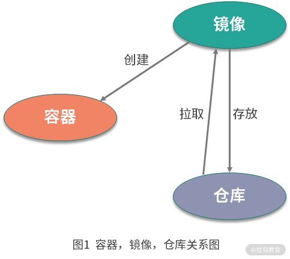
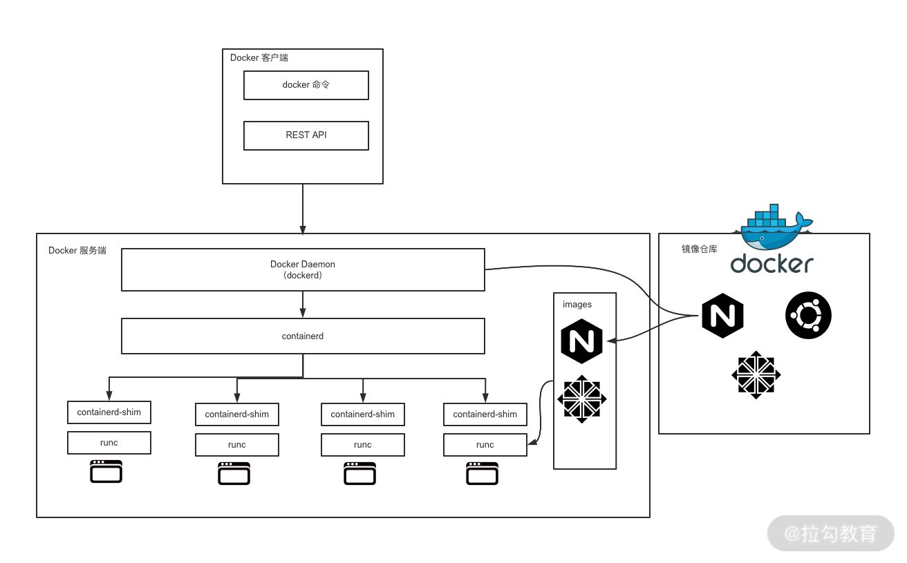
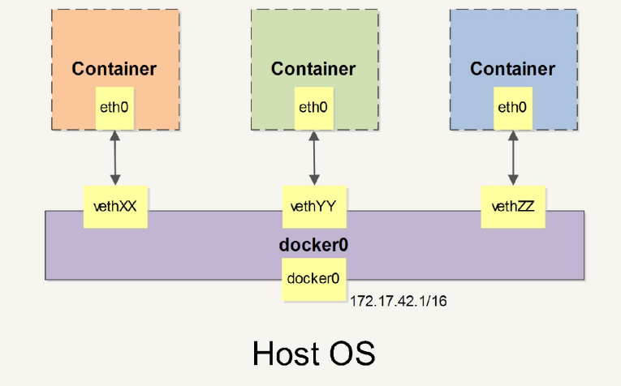

---
# 这是文章的标题
title: docker 框架与核心
# 你可以自定义封面图片
cover: 
# 这是页面的图标
icon: 
# 这是侧边栏的顺序
order: 1
# 设置作者
author: 
# 设置写作时间
date: 2024-11-29
# 一个页面可以有多个分类
category:
  - docker
# 一个页面可以有多个标签
tag:
  - docker
# 此页面会在文章列表置顶
sticky: false
# 此页面会出现在星标文章中
star: 
# 你可以自定义页脚
footer: 
# 你可以自定义版权信息
copyright: 
---

dokcer 的框架与核心概念

<!-- more -->

# Docker 框架与核心

## 一、docker 镜像、容器、仓库

### 1.1 **镜像**

- 它是一个只读的文件和文件夹组合。它包含了容器运行时所需要的所有基础文件和配置信息，是容器启动的基础。
- 所以你想启动一个容器，那首先必须要有一个镜像。

### 1.2 **容器**

- 容器是镜像的运行实体。镜像是静态的只读文件，而容器带有运行时需要的可写文件层，并且容器中的进程属于运行状态。
- 即**容器运行着真正的应用进程。容器有初建、运行、停止、暂停和删除五种状态。**
- 虽然容器的本质是主机上运行的一个进程，但是**容器有自己独立的命名空间隔离和资源限制。**也就是说，在容器内部，无法看到主机上的进程、环境变量、网络等信息，这是容器与直接运行在主机上进程的本质区别。

### 1.3 **仓库**

- Docker 的镜像仓库类似于代码仓库，用来存储和分发 Docker 镜像。
- 镜像仓库分为公共镜像仓库和私有镜像仓库。目前，[Docker Hub](https://hub.docker.com/) 是 Docker 官方的公开镜像仓库



## 二、docker 框架架构

- Docker 整体架构采用 C/S 模式，主要由客户端和服务端两大部分组成。
- 客户端负责发送操作指令，服务端负责接收和处理指令。



### 2.1 docker 客户端

有 3 种

- Docker cli
- Docker rest api
- 语言的 SDK

### 2.2 docker 服务端

Docker 服务端是 Docker 所有后台服务的统称。

- `dockerd` 是一个非常重要的后台管理进程，它负责响应和处理来自 Docker 客户端的请求，然后将客户端的请求转化为 Docker 的具体操作。
- `dockerd` 通过 `grpc` 与 `containerd` 通信

### 2.3 docker 重要组件

图上有 ⬇️

- `runc`：runC 是一个用来运行容器的轻量级工具，是真正用来运行容器的。
- `containerd`：containerd 通过 containerd-shim 启动并管理 runC，可以说 containerd 真正管理了容器的生命周期。

### 2.4 **Docker 各组件之间的关系**

```bash
docker run -d busybox sleep 3600
 #这个容器会在后台运行一个简单的sleep任务，即等待 3600 秒，然后停止。
```

启动一个 busybox 容器(是一个非常小巧的 Linux 镜)，查看进程的父子关系：

```bash
sudo pstree -l -a -A 4147
dockerd
  |-containerd --config /var/run/docker/containerd/containerd.toml --log-level info
  |   |-containerd-shim -namespace moby -workdir /var/lib/docker/containerd/daemon/io.containerd.runtime.v1.linux/moby/d14d20507073e5743e607efd616571c834f1a914f903db6279b8de4b5ba3a45a -address /var/run/docker/containerd/containerd.sock -containerd-binary /usr/bin/containerd -runtime-root /var/run/docker/runtime-runc
  |   |   |-sleep 3600
```

dockerd 启动的时候， containerd 就随之启动了，dockerd 与 containerd 一直存在。

当执行 `docker run` 命令（通过 busybox 镜像创建并启动容器）时，containerd 会创建 `containerd-shim` 充当 “垫片” 进程，然后启动容器的真正进程 sleep 3600 。

## 三、docker 数据管理

在容器中管理数据主要有两种方式：

- 数据卷（Volumes）
- 挂载主机目录 (Bind mounts)

### 3.1 数据卷

数据卷是一个<u>可供一个或多个容器使用</u>的特殊目录，它绕过 UFS，可以提供很多有用的特性：

- 数据卷 可以在容器之间共享和重用。
- 对 数据卷 的修改会立马生效。
- 对 数据卷 的更新，不会影响镜像 。
- 数据卷 默认会一直存在，即使容器被删除。

#### 创建一个数据卷

```bash
docker volume create myVolName
```

#### 查看所有数据卷

```bash
docker volume ls
```

#### 查看指定数据卷的信息

```bash
docker volume inspect my-vol
```

#### 启动一个挂载数据卷的容器

在用 `docker run` 命令的时候，使用 `--mount` 标记来将 数据卷 挂载到容器里。

在一次 `docker run` 中可以挂载多个 数据卷 。

下面创建一个名为 `web` 的容器，并加载一个 数据卷 到容器的 `/webapp ` 目录。

```bash
docker run -d -P \
    --name web \
    #-v my-vol:/wepapp \
    --mount source=my-vol, target=/webapp \
    training/webapp \
    python app.py
```

#### 删除数据卷

```bash
docker volume rm my-vol
```

### 3.2 目录挂载

#### 挂载一个主机目录作为数据卷

使用 `--mount` 标记可以指定挂载一个本地主机的目录到容器中去。

```bash
docker run -d -P \
    --name web \
    #-v my-vol:/wepapp \
    --mount type=bind,source=/src/webapp,target=/opt/webapp \
    training/webapp \
    python app.py
```

上面的命令加载主机的 `/src/webapp` 目录到容器的 `/opt/webapp` 目录。

这个功能在进行测试 的时候十分方便，比如用户可以放置一些程序到本地目录中，来查看容器是否正常工作。

本地目录的路径必须是绝对路径，以前使用 `-v` 参数时如果本地目录不存在 Docker 会自动为你创建一个文件夹，现在使用 `--mount ` 参数时如果本地目录不存在，Docker 会报错。

Docker 挂载主机目录的<u>默认权限是读写</u> ，用户也可以通过增加 `readonly` 指定为 只读 。

加了 `readonly` 之后，就挂载为只读了。如果你在容器内 /opt/webapp 目录新建文件，会显示如下错误

```bash
touch new.txt 
touch: new.txt: Read-only file system
```

#### 查看容器的数据卷具体信息

```bash
docker inspect web
```

#### 挂载一个本地主机文件作为数据卷

`--mount` 标记也可以从主机挂载单个文件到容器中

## 四、docker 网络模式

### 4.1 端口映射 外部访问容器

以通过 `-P` 或 `-p` 参数来指定端口映射。注意大小写。

当使用 `-P` 标记时，Docker 会随机映射一个 `49000~49900` 的端口到内部容器开放的网络端口。

例子：

- `docker run -d -p 5000:5000` 此时默认会绑定本地所有接口上的所有地址。
- `docker run -d -p 127.0.0.1:5000:5000` 映射到指定地址的指定端口
- `docker run -d -p 127.0.0.1::5000` 映射到指定地址的任意端口
- `docker run -d -p 127.0.0.1:5000:5000/udp` 还可以使用 udp 标记来指定 udp 端口

`-p` 标记还可以多次使用来绑定多个端口：

```bash
docker run -d \ 
  -p 5000:5000 \ 
  -p 3000:80 \
```

### 4.2 查看端口映射配置

使用 `docker port` 来查看当前映射的端口配置，也可以查看到绑定的地址。

### 4.3 容器互联

新建容器网络，`-d` 参数指定 Docker 网络类型，有 `bridge` 、`overlay`。

其中 `overlay` 网络类型用于 `Swarm mode`。

```bash
docker network create -d bridge my-net

# 运行一个容器并加入到 my-net 网络
docker run -it --rm --name busybox2 --network my-net busybox sh
```

### 4.4 网络模式

#### 基础理论

docker 使用 Linux 桥接网卡，在宿主机虚拟一个<u>docker 容器网桥</u><u>docker0</u>。

docker 启动一个容器时会根据 docker 网桥的网段分配给容器一个 IP 地址，称为 `Container-IP`，同时 Docker 网桥是每个容器的默认网络网关。

```bash
ip address

4: docker0:  mtu 1500 qdisc noqueue state DOWN group defa
ult                                                                                         
    link/ether 02:42:ef:30:24:5b brd ff:ff:ff:ff:ff:ff                                      
    inet 172.17.0.1/16 brd 172.17.255.255 scope global docker0                              
       valid_lft forever preferred_lft forever
```

因为在同一宿主机内的容器都接入同一个网桥，这样容器之间就能够通过容器的 `Container-IP` 直接通信。

docker 网桥是宿主机虚拟出来的，并不是真实存在的网络设备，外部网络是无法寻址到的，这也意味着外部网络无法通过直接 `Container-IP` 访问到容器。

如果容器希望外部访问能够访问到，可以通过端口映射，即通过 `-p或-P` 参数来启用，访问容器的时候就通过 `宿主机IP:容器端口` 访问容器。

#### Dokcer 支持的网络模式

| Docker 网络模式<br/> | 配置<br/>                      | 说明<br/>                                                                                                                                        |
| -------------------- | ------------------------------ | ------------------------------------------------------------------------------------------------------------------------------------------------ |
| host 模式<br/>       | -net=host<br/><br/>            | 容器和宿主机共享 Network namespace。<br>容器将不会虚拟出自己的网卡，配置自己的 IP 等，而是使用宿主机的 IP 和端口。<br/>                          |
| container 模式<br/>  | -net=container:NAME_or_ID<br/> | 容器和另外一个容器共享 Network namespace。<br>创建的容器不会创建自己的网卡，配置自己的 IP，而是和一个指定的容器共享 IP、端口范围。<br/>          |
| none 模式<br/>       | -net=none<br/>                 | 容器有独立的 Network namespace，并没有对其进行任何网络设置，如分配 veth pair 和网桥连接，配置 IP 等。<br>该模式关闭了容器的网络功能。<br/>       |
| bridge 模式<br/>     | -net=bridge<br/>               | (默认模式)。此模式会为每一个容器分配、设置 IP 等，并将容器连接到一个 docker0 虚拟网桥，通过 docker0 网桥以及 Iptable nat 表配置与宿主机通信<br/> |
| Macvlan network<br/> | 无<br/>                        | 容器具备 Mac 地址，使其显示为网络上的物理设备<br/>                                                                                               |
| Overlay<br/>         | 无<br/>                        | (覆盖网络)：利用 VXLAN 实现的 bridge 模式<br/>                                                                                                   |

#### Bridge 模式

容器的默认的网络模式。该模式下的容器只有宿主机可以直接访问,外部主机是不可见的。

::: tip

- Docker Daemon 利用 veth pair 技术，在宿主机上创建两个虚拟网络接口设备，假设为 veth0 和 veth1。而 veth pair 技术的特性可以保证无论哪一个 veth 接收到网络报文，都会将报文传输给另一方。
- Docker Daemon 将 veth0 附加到 Docker Daemon 创建的 docker0 网桥上。保证宿主机的网络报 文可以发往 veth0;
- Docker Daemon 将 veth1 添加到 Docker Container 所属的 namespace 下，并被改名为 eth0。 如此一来，保证宿主机的网络报文若发往 veth0 则立即会被 eth0 接收，实现宿主机到 Docker Container 网络的联通性;同时也保证 Docker Container 单独使用 eth0，实现容器网络环境的隔离性。
:::

::: tip
当创建一个 Docker 容器的时候，同时会创建了一对 `veth pair` 接口（当数据包发送到一个接口时，另外一个接口也可以收到相同的数据包）。
 这对接口一端在容器内，即 eth0 ；另一端在本地并被挂载到 docker0 网桥，名称以 veth 开头（例如 vethAQI2QT ）。

通过这种方式，主机可以跟容器通信，容器之间也可以相互通信。Docker 就创建了在主机和所有容器之间一个虚拟共享网络。
:::



#### Host 网络

host 模式相当于 Vmware 中的 NAT 模式，与宿主机在同一个网络中，但 `没有独立IP地址`。

启动容器使用 host 模式，容器将不会获得一个独立的 Network Namespace，而是和宿主机共用一个 Network Namespace。

使用 host 模式的容器可以直接使用宿主机的 IP 地址与外界通信，容器内部的服务端口也可以使用宿主机的端口，不需要进行 NAT，`host最大的优势就是网络性能比较好`，docker host 上已经使用的端口就不能再用了，网络的隔离性不好。

#### Container 网络模式

一种特殊 host 网络模式， ontainer 网络模式是 Docker 中一种较为特别的网络的模式。

在容器创建时使用 `– network=container:vm1` 指定。(vm1 指定的是运行的容器名)处于这个模式下的 Docker 容器会共享一个网络环境,这样两个容器之间可以使用 localhost 高效快速通信。

Container 网络模式没有改善容器与宿主机以外世界通信的情况(和桥接模式一样，不能连接宿主机以外的其他设备)。

这个模式指定新创建的容器和已经存在的一个容器<u>共享一个 Network Namespace</u>，而不是和宿主机共享。

新创建的容器不会创建自己的网卡，配置自己的 IP，而是和一个指定的容器共享 IP、端口范围等。 同样，两个容器除了网络方面，其他的如文件系统、进程列表等还是隔离的。两个容器的进程可以通过 lo 网卡设备通信。

#### None 模式

none 模式可以在容器创建时通过 `-- network=none` 来指定。

使用 none 模式，Docker 容器有自己的 Network Namespace，但不进行任何网络配置。容器无网卡、IP、路由等信息，需自行添加网卡、配置 IP。此模式下容器只有 lo 回环网络，无其他网卡。
