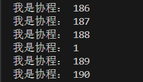
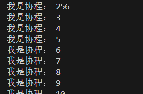
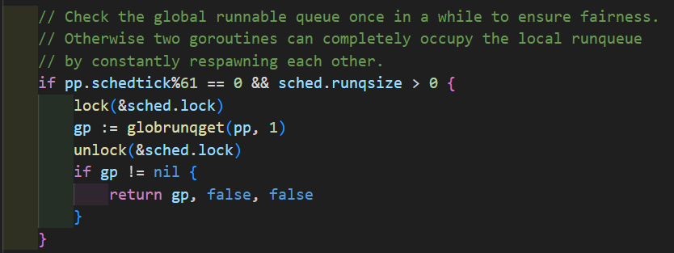
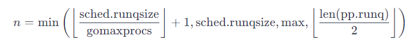
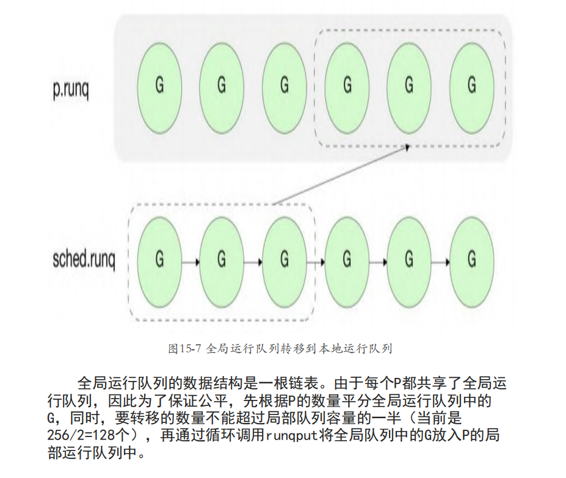

---
# 这是文章的标题
title: 理解gmp调度细节的小demo
# 你可以自定义封面图片
cover: 
# 这是页面的图标
icon: file
# 这是侧边栏的顺序
order: 2
# 设置作者
author: 
# 设置写作时间
date: 2024-12-1
# 一个页面可以有多个分类
category:
  - Go
# 一个页面可以有多个标签
tag:
  - Go
  - GMP
# 此页面会在文章列表置顶
sticky: false
# 此页面会出现在星标文章中
star: 
# 你可以自定义页脚
footer: 
# 你可以自定义版权信息
copyright: 
---


<!-- more -->

# Demo 理解 GMP

## 一、Demo 代码
::: tip

**根据 Demo，思考以下问题：**
1. 输出结果是什么？
2. 为什么先打印它，一次调度流程是怎么样的？
3. 如果 `n` 设置为 257、258，输出有什么不同？

:::

```go
package main

import (
    "fmt"
    "runtime"
    "sync"
)

func main() {
    // 设置只有一个 P 工作
    runtime.GOMAXPROCS(1)

    wg := sync.WaitGroup{}

    n := 10
    // 启动 n 个 goroutine 打印
    wg.Add(n)
    for i := 1; i <= n; i++ {
        go func(i int) {
            defer wg.Done()
            fmt.Println("我是协程：", i)
        }(i)
    }

    wg.Wait()

}
```

## 二、输出结果

**比较长...........**

### N = 10

```go
我是协程： 10
我是协程： 1
我是协程： 2
我是协程： 3
我是协程： 4
我是协程： 5
我是协程： 6
我是协程： 7
我是协程： 8
我是协程： 9
```

### N = 257

```go
我是协程： 256
我是协程： 1
我是协程： 2
我是协程： 3
我是协程： 4
我是协程： 5
我是协程： 6
我是协程： 7
我是协程： 8
我是协程： 9
我是协程： 10
我是协程： 11
我是协程： 12
我是协程： 13
我是协程： 14
我是协程： 15
我是协程： 16
我是协程： 17
我是协程： 18
我是协程： 19
我是协程： 20
我是协程： 21
我是协程： 22
我是协程： 23
我是协程： 24
我是协程： 25
我是协程： 26
我是协程： 27
我是协程： 28
我是协程： 29
我是协程： 30
我是协程： 31
我是协程： 32
我是协程： 33
我是协程： 34
我是协程： 35
我是协程： 36
我是协程： 37
我是协程： 38
我是协程： 39
我是协程： 40
我是协程： 41
我是协程： 42
我是协程： 43
我是协程： 44
我是协程： 45
我是协程： 46
我是协程： 47
我是协程： 48
我是协程： 49
我是协程： 50
我是协程： 51
我是协程： 52
我是协程： 53
我是协程： 54
我是协程： 55
我是协程： 56
我是协程： 57
我是协程： 58
我是协程： 59
我是协程： 60
我是协程： 61
我是协程： 62
我是协程： 63
我是协程： 64
我是协程： 65
我是协程： 66
我是协程： 67
我是协程： 68
我是协程： 69
我是协程： 70
我是协程： 71
我是协程： 72
我是协程： 73
我是协程： 74
我是协程： 75
我是协程： 76
我是协程： 77
我是协程： 78
我是协程： 79
我是协程： 80
我是协程： 81
我是协程： 82
我是协程： 83
我是协程： 84
我是协程： 85
我是协程： 86
我是协程： 87
我是协程： 88
我是协程： 89
我是协程： 90
我是协程： 91
我是协程： 92
我是协程： 93
我是协程： 94
我是协程： 95
我是协程： 96
我是协程： 97
我是协程： 98
我是协程： 99
我是协程： 100
我是协程： 101
我是协程： 102
我是协程： 103
我是协程： 104
我是协程： 105
我是协程： 106
我是协程： 107
我是协程： 108
我是协程： 109
我是协程： 110
我是协程： 111
我是协程： 112
我是协程： 113
我是协程： 114
我是协程： 115
我是协程： 116
我是协程： 117
我是协程： 118
我是协程： 119
我是协程： 120
我是协程： 121
我是协程： 122
我是协程： 123
我是协程： 124
我是协程： 125
我是协程： 126
我是协程： 127
我是协程： 128
我是协程： 129
我是协程： 130
我是协程： 131
我是协程： 132
我是协程： 133
我是协程： 134
我是协程： 135
我是协程： 136
我是协程： 137
我是协程： 138
我是协程： 139
我是协程： 140
我是协程： 141
我是协程： 142
我是协程： 143
我是协程： 144
我是协程： 145
我是协程： 146
我是协程： 147
我是协程： 148
我是协程： 149
我是协程： 150
我是协程： 151
我是协程： 152
我是协程： 153
我是协程： 154
我是协程： 155
我是协程： 156
我是协程： 157
我是协程： 158
我是协程： 159
我是协程： 160
我是协程： 161
我是协程： 162
我是协程： 163
我是协程： 164
我是协程： 165
我是协程： 166
我是协程： 167
我是协程： 168
我是协程： 169
我是协程： 170
我是协程： 171
我是协程： 172
我是协程： 173
我是协程： 174
我是协程： 175
我是协程： 176
我是协程： 177
我是协程： 178
我是协程： 179
我是协程： 180
我是协程： 181
我是协程： 182
我是协程： 183
我是协程： 184
我是协程： 185
我是协程： 186
我是协程： 187
我是协程： 188
我是协程： 189
我是协程： 190
我是协程： 191
我是协程： 192
我是协程： 193
我是协程： 194
我是协程： 195
我是协程： 196
我是协程： 197
我是协程： 198
我是协程： 199
我是协程： 200
我是协程： 201
我是协程： 202
我是协程： 203
我是协程： 204
我是协程： 205
我是协程： 206
我是协程： 207
我是协程： 208
我是协程： 209
我是协程： 210
我是协程： 211
我是协程： 212
我是协程： 213
我是协程： 214
我是协程： 215
我是协程： 216
我是协程： 217
我是协程： 218
我是协程： 219
我是协程： 220
我是协程： 221
我是协程： 222
我是协程： 223
我是协程： 224
我是协程： 225
我是协程： 226
我是协程： 227
我是协程： 228
我是协程： 229
我是协程： 230
我是协程： 231
我是协程： 232
我是协程： 233
我是协程： 234
我是协程： 235
我是协程： 236
我是协程： 237
我是协程： 238
我是协程： 239
我是协程： 240
我是协程： 241
我是协程： 242
我是协程： 243
我是协程： 244
我是协程： 245
我是协程： 246
我是协程： 247
我是协程： 248
我是协程： 249
我是协程： 250
我是协程： 251
我是协程： 252
我是协程： 253
我是协程： 254
我是协程： 255
```

### N = 258

```go
我是协程： 258
我是协程： 129
我是协程： 130
我是协程： 131
我是协程： 132
我是协程： 133
我是协程： 134
我是协程： 135
我是协程： 136
我是协程： 137
我是协程： 138
我是协程： 139
我是协程： 140
我是协程： 141
我是协程： 142
我是协程： 143
我是协程： 144
我是协程： 145
我是协程： 146
我是协程： 147
我是协程： 148
我是协程： 149
我是协程： 150
我是协程： 151
我是协程： 152
我是协程： 153
我是协程： 154
我是协程： 155
我是协程： 156
我是协程： 157
我是协程： 158
我是协程： 159
我是协程： 160
我是协程： 161
我是协程： 162
我是协程： 163
我是协程： 164
我是协程： 165
我是协程： 166
我是协程： 167
我是协程： 168
我是协程： 169
我是协程： 170
我是协程： 171
我是协程： 172
我是协程： 173
我是协程： 174
我是协程： 175
我是协程： 176
我是协程： 177
我是协程： 178
我是协程： 179
我是协程： 180
我是协程： 181
我是协程： 182
我是协程： 183
我是协程： 184
我是协程： 185
我是协程： 186
我是协程： 187
我是协程： 188
我是协程： 1
我是协程： 189
我是协程： 190
我是协程： 191
我是协程： 192
我是协程： 193
我是协程： 194
我是协程： 195
我是协程： 196
我是协程： 197
我是协程： 198
我是协程： 199
我是协程： 200
我是协程： 201
我是协程： 202
我是协程： 203
我是协程： 204
我是协程： 205
我是协程： 206
我是协程： 207
我是协程： 208
我是协程： 209
我是协程： 210
我是协程： 211
我是协程： 212
我是协程： 213
我是协程： 214
我是协程： 215
我是协程： 216
我是协程： 217
我是协程： 218
我是协程： 219
我是协程： 220
我是协程： 221
我是协程： 222
我是协程： 223
我是协程： 224
我是协程： 225
我是协程： 226
我是协程： 227
我是协程： 228
我是协程： 229
我是协程： 230
我是协程： 231
我是协程： 232
我是协程： 233
我是协程： 234
我是协程： 235
我是协程： 236
我是协程： 237
我是协程： 238
我是协程： 239
我是协程： 240
我是协程： 241
我是协程： 242
我是协程： 243
我是协程： 244
我是协程： 245
我是协程： 246
我是协程： 247
我是协程： 248
我是协程： 2
我是协程： 249
我是协程： 250
我是协程： 251
我是协程： 252
我是协程： 253
我是协程： 254
我是协程： 255
我是协程： 256
我是协程： 3
我是协程： 4
我是协程： 5
我是协程： 6
我是协程： 7
我是协程： 8
我是协程： 9
我是协程： 10
我是协程： 11
我是协程： 12
我是协程： 13
我是协程： 14
我是协程： 15
我是协程： 16
我是协程： 17
我是协程： 18
我是协程： 19
我是协程： 20
我是协程： 21
我是协程： 22
我是协程： 23
我是协程： 24
我是协程： 25
我是协程： 26
我是协程： 27
我是协程： 28
我是协程： 29
我是协程： 30
我是协程： 31
我是协程： 32
我是协程： 33
我是协程： 34
我是协程： 35
我是协程： 36
我是协程： 37
我是协程： 38
我是协程： 39
我是协程： 40
我是协程： 41
我是协程： 42
我是协程： 43
我是协程： 44
我是协程： 45
我是协程： 46
我是协程： 47
我是协程： 48
我是协程： 49
我是协程： 50
我是协程： 51
我是协程： 52
我是协程： 53
我是协程： 54
我是协程： 55
我是协程： 56
我是协程： 57
我是协程： 58
我是协程： 59
我是协程： 60
我是协程： 61
我是协程： 62
我是协程： 63
我是协程： 64
我是协程： 65
我是协程： 66
我是协程： 67
我是协程： 68
我是协程： 69
我是协程： 70
我是协程： 71
我是协程： 72
我是协程： 73
我是协程： 74
我是协程： 75
我是协程： 76
我是协程： 77
我是协程： 78
我是协程： 79
我是协程： 80
我是协程： 81
我是协程： 82
我是协程： 83
我是协程： 84
我是协程： 85
我是协程： 86
我是协程： 87
我是协程： 88
我是协程： 89
我是协程： 90
我是协程： 91
我是协程： 92
我是协程： 93
我是协程： 94
我是协程： 95
我是协程： 96
我是协程： 97
我是协程： 98
我是协程： 99
我是协程： 100
我是协程： 101
我是协程： 102
我是协程： 103
我是协程： 104
我是协程： 105
我是协程： 106
我是协程： 107
我是协程： 108
我是协程： 109
我是协程： 110
我是协程： 111
我是协程： 112
我是协程： 113
我是协程： 114
我是协程： 115
我是协程： 116
我是协程： 117
我是协程： 118
我是协程： 119
我是协程： 120
我是协程： 121
我是协程： 122
我是协程： 123
我是协程： 124
我是协程： 125
我是协程： 126
我是协程： 127
我是协程： 128
我是协程： 257
```

## 三、问题解答

### 为什么先打印它，一次调度流程是怎么样的？

::: tip

该问题以 `n = 10` 的结果展开讨论。

1. 打印是有序的，先创建的 g 先被调度执行。
2. 最后创建的 `10` 却是最先被调度。

:::

这段 demo 中设置了 `runtime.GOMAXPROCS(1)`，也就是只有一个 `P` 能够工作，不设置就是默认等于 cpu 的核心数。

因为只有一个 P，所以创建的协程 G 会被依次放入到 P 的本地队列中，然后被调度执行。

那么为什么最先调度的是 g10？？

因为 GMP 在运行时，有一个 `runnext` 指针，会指向最新切换进来的协程 g，把原本指向的 g 放入到 P 的本地队列中。

**模拟一下：**

- g1 创建：`Runnext --> g1` 、`P --> nil`
- g2 加入调度：`runnext ---> g2`、`P --> g1`
- g3 加入调度：`runnext ---> g3`、`P --> g1、g2`

........

- g10 加入调度：`runnext ---> g10`、`P --> g1、... 、g9`

### 如果 `n` 设置为 257、258，打印输出的规律是什么？

::: tip

先解释一下为什么选 `257` 和 `258` 两个数值：

- **257：**P 本地队列的长度是 256，runnext 又可以指向一个 g，加起来就是 257。
- **258：**`258 个 g` >` 最大的本地队列长度256 + 1`，就会把部分 g 放进全局队列，多了全局队列的参与，调度又会发生很多不同。

:::


**根据上面 问题 1 的模拟过程，我们可以知道：**

- g257 加入调度：
  `runnext ---> g257`、`P --> g1、... 、g256`、`Global：--> nil`
- g258 加入调度，把 g257 切换出来，由于 P 已经满了，会把 P 的一半 1-128 放到全局队列，再把 257 也放到全局队列：
  `runnext ---> g258`、`P --> g129 、... 、g256`、`Global：--> g1、...、g128、g257`

**所以当 n = 257 的时候：**

- 会先调度 g257，然后再在 P 中从 g1 到 g256 依次调度。
- 输出结果也是如此。

**但是 当 n = 258 的时候：**

- 先调度 g258，
- 后面先调度本地队列 P 的待执行的 g。
- (思考) 但是发现到 g188 的时候，突然又调度了一下 g1，在接着调度 g189。到 g248 之后又到了 g2。




- 接下来把 p 本地队列中的最后一个 g256 调度后，就开始从 g3 开始调度堆积在全局队列的 g。



- 最后 s 把全局队列的 g 全部调度完了。


回想八股：GMP 模型下，内核线程 M 每调度 61 次本地队列 p 中的协程后，都会去全局队列中获取一个 g 来执行。

- **But：** 188 - 128 = 60，也就是完整调度了 60 次就去全局队列中偷一个协程 g 了，岂不是八股错了？
- **哦哦哦：** GMP 调度过程不仅仅只处理用户定义的协程，还有一些 runtime 本来就有的协程要调度，也会算到这 61 次里面。只是其中的 60 次调度了用户定义的 g。



再回想八股：当 P 为空时，会去全局队列中拿一批 g 回来调度

- 一批是多少：

```go
// 简化版：
n = min( len(global) / GOMAXPROCS + 1, len(global/2) )
```

- 因为设置了 `GOMAXPROCS = 1`，所以 `n = min ( 129 / 1 + 1 , 129 / 2) = 全拿`

**详细如下：**





```go
// Try get a batch of G's from the global runnable queue.
// sched.lock must be held.
func globrunqget(pp *p, max int32) *g {
    assertLockHeld(&sched.lock)

    if sched.runqsize == 0 {
        return nil
    }

    n := sched.runqsize/gomaxprocs + 1
    if n > sched.runqsize {
        n = sched.runqsize
    }
    if max > 0 && n > max {
        n = max
    }
    if n > int32(len(pp.runq))/2 {
        n = int32(len(pp.runq)) / 2
    }

    sched.runqsize -= n

    gp := sched.runq.pop()
    n--
    for ; n > 0; n-- {
        gp1 := sched.runq.pop()
        runqput(pp, gp1, false)
    }
    return gp
}
```
