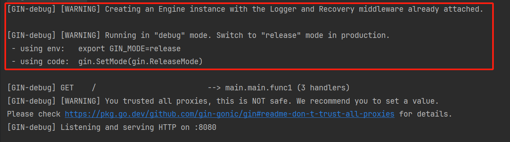
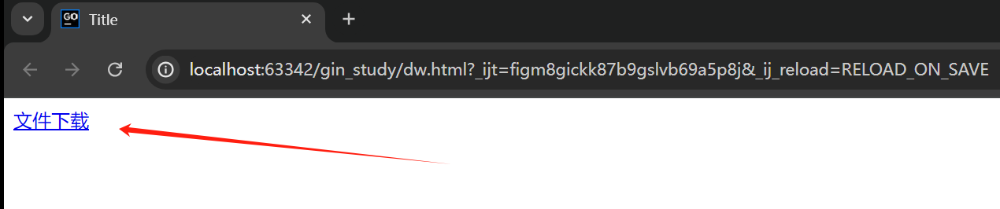
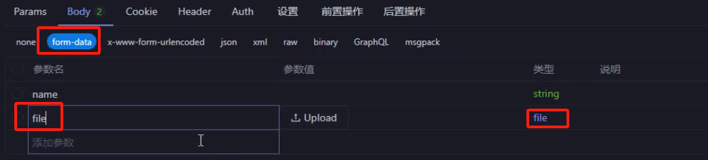

本文详细介绍Go语言Gin框架的基础知识和使用方法。

<!-- more -->

## 1. 内置的 http 库

### 1.1 不方便的地方

主要体现在：

1. 参数解析与验证
2. 路由不太明了
3. 响应处理比较原始

### 1.2 启动一个 web 服务端

```go
package main

import (
    "encoding/json"
    "fmt"
    "net/http"
)

// Response 响应结构体
type Response struct {
    Code int    `json:"code"`
    Data any    `json:"data"`
    Msg  string `json:"msg"`
}

// GET 处理GET请求
func GET(res http.ResponseWriter, req *http.Request) {
    // 获取参数
    fmt.Println(req.URL.String())
    // 封装响应数据
    data, _ := json.Marshal(Response{
       Code: 200,
       Data: map[string]any{},
       Msg:  "成功",
    })
    res.Write(data)
}

func main() {
    http.HandleFunc("/index", GET)
    // 启动一个web服务
    http.ListenAndServe("localhost:8080", nil)
}
```

## 2. Gin 的初始化

### 2.1 安装 gin 库

```bash
go get github.com/gin-gonic/gin
```

### 2.2 Hello world

熟悉一下gin框架的默认三板斧：

```go
package main

import "github.com/gin-gonic/gin"

func main() {
    // 1 初始化gin引擎
    r := gin.Default()
    // 2 设置路由
    r.GET("/", func(c *gin.Context) {
       c.String(200, "hello world")
    })
    // 3 监听运行
    r.Run(":8080")
}
```

### 2.3 知识扩展

#### 内网运行

让内网中的其他人访问，地址不要写 127.0.0.1 本地的回环地址即可：

```go
r.Run(":8080") // 等价于 r.Run("0.0.0.0:8080")
```

#### 关闭日志的debug输出

不想看到gin默认的那些debug输出：



设置运行模式即可，默认是 debug：

```go
gin.SetMode("release")
```

## 3. Gin 响应

gin提供了很多响应的方法：string、json、html等等

### 3.1 Json 响应

200是http的状态码，但是一般还会有业务状态码是另外统一封装的：

```go
c.JSON(200, gin.H{
  "code": 0,
  "msg": "ok",
})
```

### 3.2 封装业务状态码

```go
type Code int

// 业务状态码
const (
  RoleErrCode    Code = 1001
  NetworkErrCode Code = 1002
)

// 业务状态码对应的具体含义
var codeMap = map[Code]string{
  RoleErrCode:    "权限错误",
  NetworkErrCode: "网络错误",
}
```

### 3.3 html 响应

前后端分离的时代，也很少使用后端返回模板，知道怎么用就好。

将 html 的模版文件放在 templates 下：
- 使用LoadHTMLGlob加载一个目录下的所有html文件，也可以使用LoadHTMLFiles加载单个html文件
- load 之后，下面才能用这个文件名

```go
func main() {
  r := gin.Default()
  // 加载模板 只有这里加载了模板，下面才能用
  r.LoadHTMLGlob("templates/*")
  //r.LoadHTMLFiles("templates/index.html")
  r.GET("", func(c *gin.Context) {
    c.HTML(200, "index.html", nil) // HTML的第三个参数是可以向HTML中传递数据
  })
  r.Run(":8080")
}
```

### 3.4 响应文件

1. 设置 Content-Type，唤起浏览器的下载
2. 只能是 get 请求

```go
// 设置响应头Content-Type为application/octet-stream，表示这是一个二进制文件流
c.Header("Content-Type", "application/octet-stream")

// 设置Content-Disposition响应头，attachment表示这是一个附件
// filename="3.文件下载.go"用于指定下载下来的文件名
c.Header("Content-Disposition", "attachment; filename=\"3.文件下载.go\"")

// 发送文件到客户端，文件路径为"./3.文件下载.go"
// 浏览器会根据前面的响应头信息，提示用户下载该文件
c.File("./3.文件下载.go")
```

**最佳实践：**

1. 调下载接口的请求，后端不返回实际文件内容，而是生成一个临时下载地址
2. 前端构造a标签，再请求这个接口唤起浏览器下载

```html
<a href="文件路径" download="文件名">文件下载</a>
```



### 3.5 配置静态文件

gin也可以通过内置方法构造静态文件的路径。

静态文件的路径，不能再被路由使用了：

```go
r.Static("static", "static") // 第一个参数是别名，第二个才是实际路径
r.StaticFile("abcd", "static/abc.txt")
```

## 4. 获取请求参数

### 4.1 查询参数

- 比如：http://xxxxx/xxx?key=xxx&name=xxxx&name=yyyy 这种就被称为查询参数
- 查询参数不是GET请求专属的，post请求也可以有

```go
name := c.Query("name")
age := c.DefaultQuery("age", "25")

keyList := c.QueryArray("key")
fmt.Println(name, age, keyList)
```

例如请求 ?name=fengfeng&age=123&key=123&key=124，输出为：

fengfeng 123 [123 124]

### 4.2 动态参数

- 查询参数的模式：/users?id=123 
- 动态参数模式：/users/123 

实现方式：

```go
r.GET("users/:id", func(c *gin.Context) {
  userID := c.Param("id")
  fmt.Println(userID)
})
```

### 4.3 表单参数

一般专指 form 表单。

**注意！接口测试工具能走通的，前端请求不一定可以走通的情况：**

1. get请求带请求体
2. ws加请求头

**获取表单参数的方法：**

```go
// 从POST请求中获取表单字段"name"的值
name := c.PostForm("name")

// 从POST请求中获取表单字段"age"的值，同时检查该字段是否存在
age, ok := c.GetPostForm("age")

// 输出获取到的"name"值
fmt.Println(name)

// 输出获取到的"age"值和一个布尔值，表示该字段是否存在
fmt.Println(age, ok)
```

**实现一个文件上传功能：**



```go
// 方式 1：
// c.SaveUploadedFile会将上传的文件保存到服务器上的指定路径
// 参数fileHeader是文件头信息，"uploads/xxx/yyy/"+fileHeader.Filename是目标路径
fileHeader, err := c.FormFile("file")
err = c.SaveUploadedFile(fileHeader, "uploads/xxx/yyy/" + fileHeader.Filename)
fmt.Println(err)


// 方式 2：
r.POST("users", func(c *gin.Context) {
  // 从请求中获取文件头
  fileHeader, err := c.FormFile("file")
  if err != nil {
    // 如果获取文件头出现错误，打印错误并返回
    fmt.Println(err)
    return
  }
  
  // 输出文件名
  fmt.Println(fileHeader.Filename)
  // 输出文件大小（单位：字节）
  fmt.Println(fileHeader.Size)

  // 打开文件
  file, _ := fileHeader.Open()
  // 读取文件内容
  byteData, _ := io.ReadAll(file)

  // 将文件内容写入名为 "xxx.jpg" 的文件
  err = os.WriteFile("xxx.jpg", byteData, 0666)
  // 输出可能出现的错误
  fmt.Println(err)
})
```

## 5. bind 绑定器

- Gin的bind功能可以将HTTP请求的各种数据格式（如JSON、XML、表单数据等）自动解析并绑定到结构体中
- **ShouldBind()这个方法会根据请求的Content-Type自动选择合适的绑定器**

### 5.1 查询参数

```go
// 定义一个User结构体，用于存储绑定的数据
type User struct {
    // Name字段对应URL查询参数中的"name"
    Name string `form:"name"`
    // Age字段对应URL查询参数中的"age"
    Age  int    `form:"age"`
}

// 创建一个User结构体实例，用于接收绑定的数据
var user User

// 使用ShouldBindQuery方法将URL查询参数绑定到user结构体
// ShouldBindQuery会根据结构体字段的form标签从URL查询参数中解析数据
err := c.ShouldBindQuery(&user)

// 打印绑定后的user结构体和可能出现的错误
fmt.Println(user, err)

// 返回绑定后的数据作为JSON响应
c.JSON(200, gin.H{
    "name": user.Name,
    "age":  user.Age,
})
```

### 5.2 路径参数

```go
package main

import (
    "fmt"
    "github.com/gin-gonic/gin"
)

type User struct {
    Name string `uri:"name"`
    ID   int    `uri:"id"`
}

func main() {
    r := gin.Default()
    
    r.GET("/user/:name/:id", func(c *gin.Context) {
        var user User
        // 使用ShouldBindUri方法将URI路径参数绑定到user结构体
        err := c.ShouldBindUri(&user)
        
        // 打印绑定后的user结构体和可能出现的错误
        fmt.Println(user, err)

        // 返回绑定后的数据作为JSON响应
        c.JSON(200, gin.H{
            "name": user.Name,
            "id":   user.ID,
        })
    })

    r.Run() // 默认监听并在 0.0.0.0:8080 上启动服务
})
```

### 5.3 表单参数

```go
// 定义一个User结构体，用于存储绑定的数据
type User struct {
    // Name字段对应表单数据或查询参数中的"name"
    Name string `form:"name"`
    // Age字段对应表单数据或查询参数中的"age"
    Age  int    `form:"age"`
}

// 创建一个User结构体实例，用于接收绑定的数据
var user User

// 使用ShouldBind方法将请求数据绑定到user结构体
// ShouldBind会根据请求的Content-Type自动选择合适的绑定器
// 如果请求是application/x-www-form-urlencoded或multipart/form-data，它会从表单数据中提取
// 如果请求是application/json，它会从JSON数据中提取
err := c.ShouldBind(&user)

// 打印绑定后的user结构体和可能出现的错误
fmt.Println(user, err)

// 返回绑定后的数据作为JSON响应
c.JSON(200, gin.H{
    "name": user.Name,
    "age":  user.Age,
})
```

### 5.4 Json 参数

```go
type User struct {
  Name string `json:"name"`
  Age  int    `json:"age"`
}
var user User
err := c.ShouldBindJSON(&user)
fmt.Println(user, err)
```

### 5.5 Header 参数

```go
// 定义一个User结构体，用于存储从请求头中绑定的数据
type User struct {
    // Name字段对应请求头中的"Name"
    Name string `header:"Name"`
    // Age字段对应请求头中的"Age"
    Age int `header:"Age"`
    // UserAgent字段对应请求头中的"User-Agent"
    UserAgent string `header:"User-Agent"`
}
```


