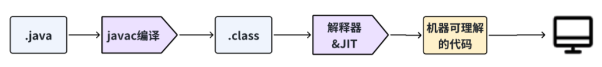

# Java基础

## 一、Java语言特性

### 1.1 Java的特点

- **面向对象**：具备封装、继承、多态、抽象、反射、泛型等特性
- **跨平台**：一次编译，到处运行，依靠JVM实现
- **稳健性**：强类型语言，异常处理

### 1.2 JVM、JDK、JRE

- **JDK** = JRE + Java工具 + 编译器 + 调试器
- **JRE** = JVM + Java核心类库

### 1.3 字节码

在Java中，JVM可以理解的代码就叫做字节码（即扩展名为.class的文件），它不面向任何特定的处理器，只面向虚拟机。Java语言通过字节码的方式，在一定程度上解决了传统解释型语言执行效率低的问题，同时又保留了解释型语言可移植的特点。

## 二、基本语法

### 2.1 关键字

| 分类 | 关键字 | | | |
|------|--------|---|---|---|
| 访问控制 | private | protected | public | |
| 类、方法和变量修饰符 | abstract | class | extends | final |
| | new | static | strictfp | synchronized |
| 程序控制 | break | continue | return | do |
| | for | instanceof | switch | case |
| 错误处理 | try | catch | throw | throws |
| 包相关 | import | package | | |
| 基本类型 | boolean | byte | char | double |
| | short | | | |
| 变量引用 | super | this | void | |
| 保留字 | goto | const | | |

### 2.2 位移运算符

- `>>` `<<` ：带符号右移和左移
- `>>>` ：无符号右移，忽略符号位，空位都以0补齐

### 2.3 final关键字的作用

- final修饰的类不能被继承
- final修饰的方法不能被重写
- final修饰的变量叫常量，常量必须初始化，初始化之后值就不能被修改

### 2.4 成员变量与局部变量

语法形式
成员变量是属于类的，而局部变量是在代码块或方法中定义的变量或是方法的参数。成员变量可以被public、private、static等修饰符所修饰，而局部变量不能被访问控制修饰符及static所修饰；但是，成员变量和局部变量都能被final所修饰。

存储方式
从变量在内存中的存储方式来看，如果成员变量是使用static修饰的，那么这个成员变量是属于类的。如果没有使用static修饰，这个成员变量是属于实例的。而对象存在于堆内存，局部变量则存在于栈内存。

生存时间
从变量在内存中的生存时间上看，成员变量是对象的一部分，它随着对象的创建而存在，而局部变量随着方法的调用而自动生成，随着方法的调用结束而消亡。

默认值
从变量是否有默认值来看，成员变量如果没有被赋初始值，则会自动以类型的默认值而赋值（一种情况例外：被final修饰的成员变量也必须显式地赋值），而局部变量则不会自动赋值。

## 三、方法

### 3.1 静态方法不能调用非静态成员
1. 静态方法是属于类的，在类加载的时候就会分配内存，可以通过类名直接访问。而非静态成员属于实例对象，只有在对象实例化之后才存在，需要通过类的实例对象去访问。
2. 在类的非静态成员不存在的时候静态方法就已经存在了，此时调用在内存中还不存在的非静态成员，属于非法操作。

